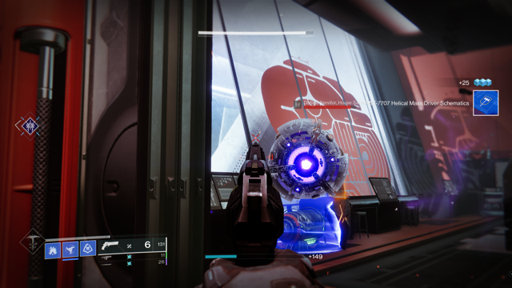
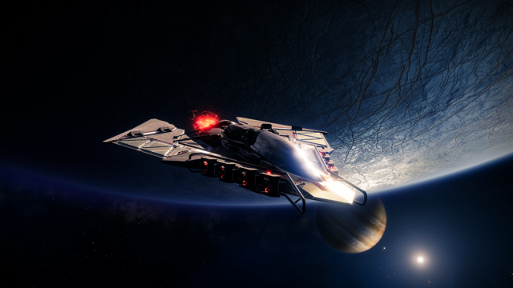
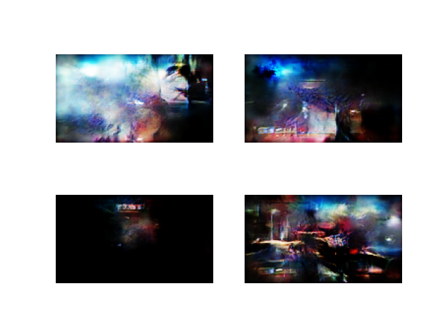

# Progressive growing of GANs
## Generating game art using Generative Adverserial Networks

This repository contains an implementation of a GAN for learning to generate images, which
I then used to let the AI generate game art of the game "Destiny 2" by training it
on screenshots of the game.
The corresponding paper by researchers from NVIDIA can be found here: https://arxiv.org/pdf/1710.10196.pdf

TLDR: The algorithm uses greedy layer-wise pretraining by first learning to generate
4x4 images, then an additional CNN layer is added (to both generator and discrimantor)
to generate 8x8 images and so on, up to the desired resolution.

## Examples

### Screenshots from the game (ground truth)

### Generated images from GAN

The images generated GAN quite look like abstract art, nonetheless I am quite
satsfied that the GAN has learned to capture some structures (Orbit, Weapons)
and the art style of the game, especially given the high variability in the data.